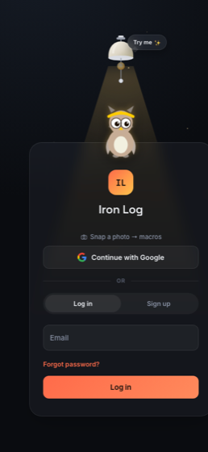
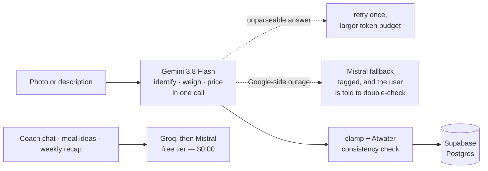
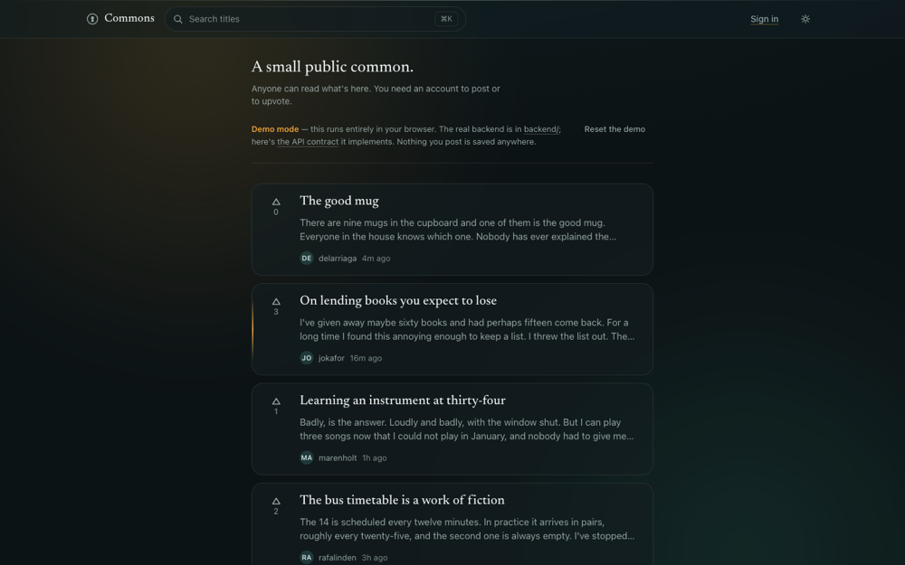

<picture>
  <source media="(prefers-color-scheme: dark)" srcset="assets/header-dark.svg" />
  <source media="(prefers-color-scheme: light)" srcset="assets/header-light.svg" />
  
</picture>

 

  

 

I'm a computer science student in Constanța, Romania, and I build full-stack web
applications end to end — backend, frontend, database, deployment. Working alone means
I've had to learn the unglamorous half too: migrations, CI, rate limits, and what a
service does at three in the morning when a third-party API returns a 504 and nobody is
watching.

Two habits I'd want you to judge me on. **Decisions get written down with what they
cost** — my larger projects carry architecture decision records that say what would
change my mind, which is what makes something a decision instead of a preference. And
**every claim below is checkable by opening the repository.** Where I have a number, I
measured it.

**Open to** junior full-stack / backend roles and software engineering internships.

 

---

## Selected work

### Iron Log — photo-to-macros nutrition tracking

<table>
<tr>
<td width="235" valign="top">
  
</td>
<td valign="top">
Point a camera at a plate and get calories, protein, carbs, fats, fibre, sugar and sodium back — **per ingredient**, not one number for the whole meal. No database to search through, no barcode needed. FastAPI on an always-on VPS behind Traefik, a vanilla-JS installable PWA on GitHub Pages, Supabase Postgres underneath.

**The most useful thing I did here was delete a feature I had already built.** Every ingredient used to be looked up against USDA and Open Food Facts before I trusted the model's own estimate — which sounds obviously correct, and measured out wrong. A lexical title match priced Romanian *telemea* cheese off a USDA row called `Bread, cheese`, and 200g of grilled pork off a crowdsourced label claiming 60g of protein per 100g. Over 20 real descriptions: **median calorie error 16.5% with the database, 2.6% without it.** The layer is still in the codebase behind a flag, because what justifies the default is the measurement, not my opinion.

`Python` `FastAPI` `PostgreSQL` `Supabase` `Docker` `Traefik` `Vite` `PWA`

**[Repository →](https://github.com/AndrewTechTips/calorie-tracker)** · **[Live →](https://andrewtechtips.github.io/calorie-tracker/)**
</td>
</tr>
</table>

285 commits · ~700 tests · 72 API endpoints · zero runtime JavaScript dependencies · CI runs pytest, then deploys over SSH on green

The AI pipeline is split by whether anything downstream does arithmetic with the output.
Anything that becomes a number the user sees goes to the paid model; prose and
suggestions run on a free tier and cost nothing:

Truncated responses were costing real money before I measured them: hidden reasoning
tokens draw from the same budget as the visible answer, so **43% of first attempts were
being cut off, billed in full, and retried.** Sizing the reserve from 33 recorded calls
instead of one took truncation to 0% and cut the mean cost per scan from $0.0144 to
$0.0088.

 

### Commons — a small public social feed

  

Anyone can read the feed; you need an account to post or upvote. **FastAPI + PostgreSQL
17** behind a hand-written frontend with no framework, no bundler and no build step —
type-checked anyway, through JSDoc and `tsc --noEmit`.

The part I'd point at: GitHub Pages serves static files and has nowhere to run FastAPI,
so rather than publish a link that opens on *"Can't reach the server"*, the published
build reimplements the API in the browser. **The end-to-end suite then runs the same
specs against both implementations**, so the site people click and the API the project
ships cannot quietly drift apart.

Some things I got wrong first, and what fixed them:

- The feed served **unpublished drafts to everybody** while the UI politely labelled them
  "Draft". Visibility is now an access rule — *published, or yours* — and someone else's
  draft answers `404`, not `403`, because a `403` would confirm it exists.
- **Login returned early for an unknown email**, skipping the bcrypt round a wrong
  password paid for. About 100ms of difference, which told you which addresses had
  accounts whatever the response body said. The miss path now verifies against a fixed
  dummy hash.
- The refresh token moved out of `localStorage` into an **`httpOnly` cookie** with
  rotation and reuse detection — so an XSS bug can act as you while the tab is open, and
  can't walk away with the session.

`Python` `FastAPI` `SQLAlchemy 2.0` `PostgreSQL` `Alembic` `JWT` `Playwright` `Docker`

231 pytest tests at 97% coverage · 338 Playwright tests run against two API implementations · `mypy --strict`, `black`, `pip-audit`, Lighthouse and axe in CI · 6 architecture decision records

**[Repository →](https://github.com/AndrewTechTips/social-feed-application)** · **[Live demo →](https://andrewtechtips.github.io/social-feed-application/)** · **[Decisions →](https://github.com/AndrewTechTips/social-feed-application/tree/main/docs/adr)**

 

### Also worth a look

<table>
<tr>
<td width="50%" valign="top">

**[Portfolio — WebGL hero](https://github.com/AndrewTechTips/Portfolio-Website)**

A scroll-driven 360° camera orbit around a bronze horse, a hand-written GLSL wave shader, and a procedural spark system — which then *settles* into a blurred backdrop while a normal, filterable project grid scrolls over it. Three.js is the only dependency, and it's vendored rather than pulled from a CDN.

`JavaScript` `Three.js` `GLSL` — no framework, no build step

[Live →](https://andrewtechtips.github.io/Portfolio-Website/)
</td>
<td width="50%" valign="top">

**[Ace Barbers — client-style landing page](https://github.com/AndrewTechTips/cxr-barbershop)**

A premium dark-mode barbershop site built to production standard from scratch: scroll-triggered reveals on `IntersectionObserver`, GPU-composited effects, and a custom bilingual (RO/EN) translation engine that swaps every string instantly and remembers the choice.

`HTML` `CSS` `JavaScript` — hand-rolled, zero libraries

[Live →](https://andrewtechtips.github.io/cxr-barbershop/)
</td>
</tr>
</table>

| Project | What it is | Built with |
| :--- | :--- | :--- |
| **[ODE Solver](https://github.com/AndrewTechTips/Project_Calcul_Numeric)** | Solves `y' = f(x, y)` by Euler, Heun and RK4, animates the solution step by step, and — when a closed form exists — derives it symbolically and plots the error against each approximation | `Python` `Streamlit` `SymPy` `Plotly` |
| **[Student Management System](https://github.com/AndrewTechTips/Student-Management-System)** | Desktop CRUD over student records: live filtering as you type, CSV export, regex validation before any write, credentials out of a `.env` rather than the source | `Python` `PyQt6` `MySQL` |
| **[Climate Data API](https://github.com/AndrewTechTips/European-Climate-Archive-API)** | A REST API over real ECA&D station records — by date, by station, or by year — with a self-documenting index page | `Python` `Flask` `pandas` |
| **[Thief Detection Notifier](https://github.com/AndrewTechTips/Thief-Detection-Notifier)** | Frame-delta motion detection that captures the intruder and emails the frame from a background thread, so the video pipeline never drops a frame waiting on SMTP | `Python` `OpenCV` |
| **[Django Restaurant Menu](https://github.com/AndrewTechTips/Django-Restaurant-Menu)** | Contactless ordering: a session-backed cart that never touches the database for guests, plus generated per-table QR codes | `Python` `Django` |

 

---

## What I actually work with

| | |
| :--- | :--- |
| **Languages** | Python · JavaScript (ES modules) · SQL · HTML/CSS |
| **Backend** | FastAPI · Django · Flask · SQLAlchemy 2.0 · Alembic · Pydantic · JWT auth |
| **Data** | PostgreSQL · Supabase · MySQL · SQLite · pandas |
| **Frontend** | Vanilla ES modules · Vite · Webpack · Three.js + GLSL · PWA & service workers · CSS design tokens |
| **Testing** | pytest · Playwright · Jest · `mypy --strict` · axe · Lighthouse |
| **Infrastructure** | Docker & Compose · Traefik · GitHub Actions · Linux VPS · GitHub Pages |
| **Also used** | OpenCV · Selenium · PyQt6 · Streamlit · Plotly · SymPy |

Java and x86 assembly come from university coursework; that code sits in private repositories, so I've left it off the list above rather than claim it here.

 

---

## A note on how I build

I default to **no framework and no build step** until something earns one. That isn't
minimalism for its own sake — it's that a dependency is a thing you carry, and on
projects this size I'd rather carry a hundred lines I can read. Where a build step does
pay for itself, it goes in: Iron Log uses Vite, purely so content-hashed filenames
replace a cache-busting convention I was maintaining by hand and getting wrong.

The same instinct shows up in testing. I don't chase coverage numbers; I write tests
around the logic that would be **expensive to get wrong and invisible when it breaks** —
quota resets, retention cutoffs, streak arithmetic, notification eligibility, whether a
background sweep survives the database blinking.

 

---

## Certifications

 

Harvard University · Cambridge Assessment English

 

---

  

**Currently** building Iron Log, and reading about how to keep an always-on service honest when the things it depends on aren't.

 

  

